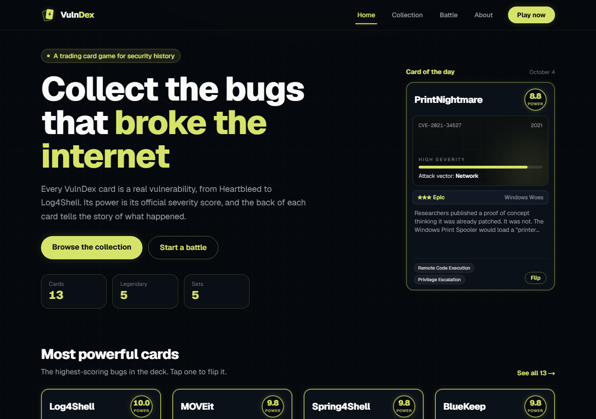
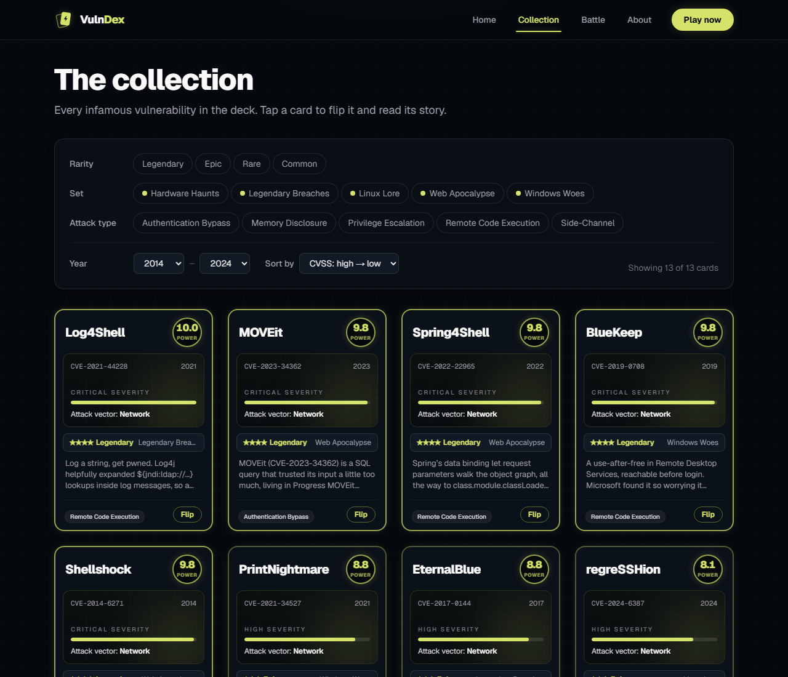
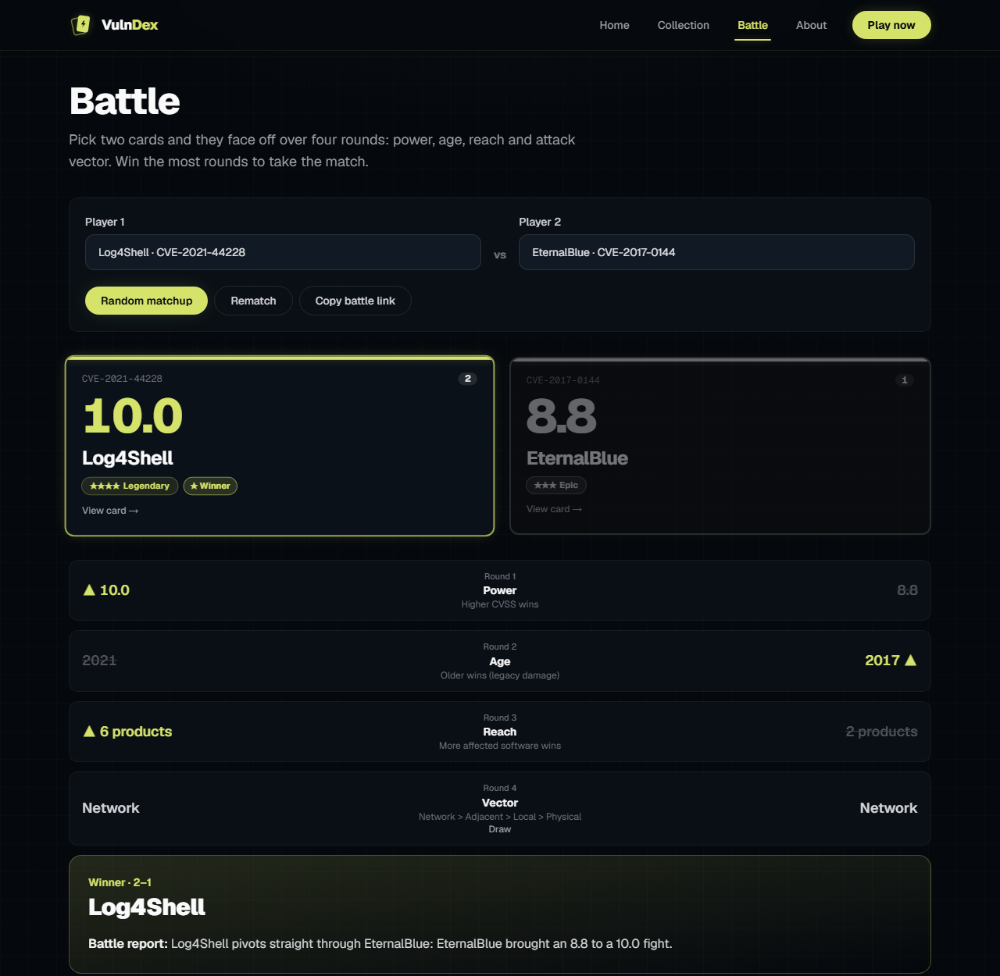
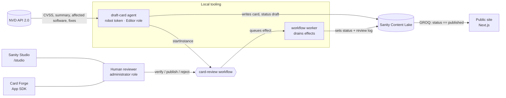

# VulnDex

**History's most infamous bugs, now collectible.** VulnDex is a trading card game where every card is a real vulnerability (Heartbleed, Log4Shell, EternalBlue and more), with its official severity score as its power and the story of what happened on the back.

Built for the DEV Sanity Challenge with Next.js and Sanity, including Sanity Workflows and the Sanity App SDK.

---

## Screenshots

> Placeholders: drop images into `docs/screenshots/` with these names.

| Home | Collection |
| --- | --- |
|  |  |

| Card (front and back) | Battle |
| --- | --- |
|  |  |

| Studio review workflow | Card Forge (App SDK) |
| --- | --- |
|  |  |

---

## Features

### Card gallery
- Every card is a real CVE. **Power** is its CVSS score from the National Vulnerability Database (NVD), and **rarity** follows from it: 9+ Legendary, 7–8.9 Epic, 4–6.9 Rare, under 4 Common.
- Cards flip in 3D: the front shows power, severity, attack vector and set; the back has the story, affected software and how it was patched.
- Filter by rarity, set, attack type and year range; sort by power or year. Filters live in the URL, so a filtered view can be shared.
- A detail page per card, a Card of the Day on the home page, and an About page.

### Battle mode
- Pick two cards (searchable pickers or a random matchup) and they face off over four rounds: **Power** (higher CVSS), **Age** (older wins), **Reach** (more affected software) and **Attack vector** (Network > Adjacent > Local > Physical).
- Rounds reveal one by one, then a winner and a generated battle report.
- Every matchup has a shareable URL, e.g. `/battle?a=CVE-2021-44228&b=CVE-2017-0144`.

### Review pipeline (Sanity Workflows)
- New cards go through a `card-review` workflow: **draft → verified → published**, with **reject (with a reason) back to draft**.
- An agent drafts cards from NVD data; only a human can verify, publish or reject.
- Studio shows the workflow on each card (via the Workflows Studio plugin), and each card keeps a review log of who moved it and when.

### Card Forge (Sanity App SDK)
- A curator dashboard that runs in the Sanity Dashboard, separate from Studio.
- Live kanban board (Draft · Verified · Published · Rejected) that updates without a refresh.
- Review actions on each tile go through the same workflow transitions as Studio.
- Stats bar (totals, rarity counts, pending reviews, average power) and a "Draft new card" box that triggers the agent.

---

## Architecture



1. **Agent drafts.** `npm run draft-card CVE-2024-3400` (or the Card Forge input) fetches the CVE from NVD, writes the story and patch notes from those facts, saves the card with `status: "draft"`, and starts a `card-review` workflow instance.
2. **Human reviews.** In Studio or Card Forge, a reviewer verifies the card, then publishes it, or rejects it with a reason. These actions require the **administrator** role; the agent's token has the Editor role, so the engine refuses them.
3. **Worker applies it.** Workflow actions can only change workflow data, so each one queues an **effect**. The workflow worker drains effects and updates the card's `status`, `rejectionReason` and `reviewLog` (mirrored from the workflow's own audit trail). A transition only completes once its effect has run, so a card reaches "published" in the workflow only once it really is.
4. **Public site shows it.** The site queries `status == "published"` only, so drafts and rejected cards never appear.

More detail, including what is and isn't enforced: [docs/workflow.md](docs/workflow.md).

---

## Tech stack

| Area | Tools |
| --- | --- |
| Site | Next.js 16 (App Router), React 19, TypeScript, Tailwind CSS 4 |
| Content | Sanity Content Lake, embedded Sanity Studio 6 (`next-sanity`) |
| Review pipeline | Sanity Workflows 0.36 (early access): `@sanity/workflow-engine`, `@sanity/workflow-studio-plugin` |
| Curator app | Sanity App SDK 3.7 (`@sanity/sdk-react`), `@sanity/workflow-sdk` |
| Data | NVD API 2.0, CISA Known Exploited Vulnerabilities (via NVD) |
| Scripts | `tsx` for the seed, agent, deploy and worker scripts |

---

## Project structure

```
src/app/(site)/        Public site: home, collection, card detail, battle, about
src/app/studio/        Embedded Sanity Studio at /studio
src/app/api/agent/     Endpoint Card Forge uses to run the agent
src/components/        Card, gallery filters, battle arena, nav
src/sanity/            Schemas, client, GROQ queries, Studio config
src/workflows/         card-review workflow definition
scripts/               seed, draft-card agent, workflow deploy + worker
card-forge/            Sanity App SDK app (separate package)
docs/workflow.md       Workflow design and enforcement notes
```

---

## Run it locally

**Requirements:** Node.js 22.12+ (the App SDK needs it), a Sanity project, and a Sanity account in an organization (for Card Forge).

### 1. Main app

```bash
npm install
cp .env.example .env.local      # then fill in the values (see below)
npm run seed                    # 12 cards, 5 sets, 5 attack types from NVD
npm run workflow:deploy         # deploy the card-review workflow
npm run dev                     # http://localhost:3000 (Studio at /studio)
```

In sanity.io/manage → API → CORS origins, add `http://localhost:3000` with **Allow credentials** so Studio can sign in.

### 2. Workflow worker

Keep this running while reviewing cards, or Studio actions won't update the cards:

```bash
npm run workflow:worker         # or: npm run workflow:worker -- --once
```

Draft a card with the agent:

```bash
npm run draft-card CVE-2023-4966 -- --nickname "Citrix Bleed"
```

### 3. Card Forge

```bash
cd card-forge
npm install
npm run dev                     # serves on http://localhost:3333
```

Open the URL it prints, `https://www.sanity.io/@<org-id>?dev=http://localhost:3333`, and find **Card Forge** in the Dashboard sidebar. Also add `http://localhost:3333` (Allow credentials) to CORS origins. Use Chrome or Firefox; Safari has a known issue with local App SDK apps.

To point Card Forge at your own project, edit `card-forge/src/config.ts` (project and dataset) and `card-forge/sanity.cli.ts` (organization ID).

---

## Environment variables

From [.env.example](.env.example); copy it to `.env.local`.

| Variable | Used by | Notes |
| --- | --- | --- |
| `NEXT_PUBLIC_SANITY_PROJECT_ID` | Site, Studio, scripts | Public |
| `NEXT_PUBLIC_SANITY_DATASET` | Site, Studio, scripts | Public, e.g. `production` |
| `NEXT_PUBLIC_SANITY_API_VERSION` | Site, Studio | Public, e.g. `2026-05-15` |
| `SANITY_API_READ_TOKEN` | Site (server only) | Only if your dataset is private. Viewer role |
| `SANITY_API_WRITE_TOKEN` | Seed, agent, worker, agent endpoint | **Local only.** Robot token, Editor role |
| `NVD_API_KEY` | Seed, agent | Optional; raises the NVD rate limit |
| `CARD_FORGE_ORIGINS` | Agent endpoint | Optional; defaults to `http://localhost:3333` |
| `SANITY_APP_AGENT_URL` | Card Forge (build time) | Optional; defaults to `http://localhost:3000`. Not a secret: `SANITY_APP_*` values are bundled into the browser |

---

## Security notes

- **The public site needs no token.** The dataset is public and the site only reads `status == "published"` cards. Deploying to Vercel needs only the three `NEXT_PUBLIC_*` variables.
- **No write tokens on Vercel.** `SANITY_API_WRITE_TOKEN` stays in your local `.env.local`. The agent, worker and agent endpoint are local tooling; on a deployment without the token, the agent endpoint simply fails.
- **The agent can't publish.** It runs on a robot token with the **Editor** role, while verify, publish and reject require **administrator**. Tested: with the agent's token, the engine reports those actions as not allowed and refuses to fire them (`ActionDisabledError`).
- **What that does and doesn't guarantee.** Workflow role checks run in the engine (the caller's process), so they stop the agent as long as it goes through the workflow, which the agent always does. They are not a database-level lock: an Editor token could still write `status: "published"` directly. Making that impossible needs a custom role that can't publish (an Enterprise feature) or lake-enforced workflow guards, which Sanity hasn't shipped yet. Details in [docs/workflow.md](docs/workflow.md).
- **Card Forge holds no secrets.** It uses your Dashboard session. "Draft new card" sends your own Sanity token to the agent endpoint, which only runs the agent for members of the project.
- **Workflow data stays private.** Workflow definitions and instances use dotted document IDs, which Sanity keeps private even in a public dataset.
- `.env*` files are gitignored (only `.env.example`, with placeholders, is committed).

---

## Scripts

| Command | What it does |
| --- | --- |
| `npm run dev` | Site + Studio on :3000 |
| `npm run build` | Production build |
| `npm run seed` | Seed cards, sets and attack types from NVD (`-- --dry-run` to preview) |
| `npm run draft-card CVE-…` | Agent drafts a card and starts its review (`-- --nickname "…"`, `-- --dry-run`) |
| `npm run workflow:deploy` | Deploy the workflow definition (`-- --check` to validate only) |
| `npm run workflow:worker` | Run the effect worker (`-- --once` for a single pass) |

---

## Credits

- Vulnerability data (CVSS scores, descriptions, affected software, fixed versions) from the **[National Vulnerability Database](https://nvd.nist.gov)**, NIST. This product uses the NVD API but is not endorsed or certified by the NVD.
- Exploited-in-the-wild status from **CISA's [Known Exploited Vulnerabilities catalog](https://www.cisa.gov/known-exploited-vulnerabilities-catalog)**, via NVD.
- Built with [Sanity](https://www.sanity.io) and [Next.js](https://nextjs.org) for the DEV Sanity Challenge.
